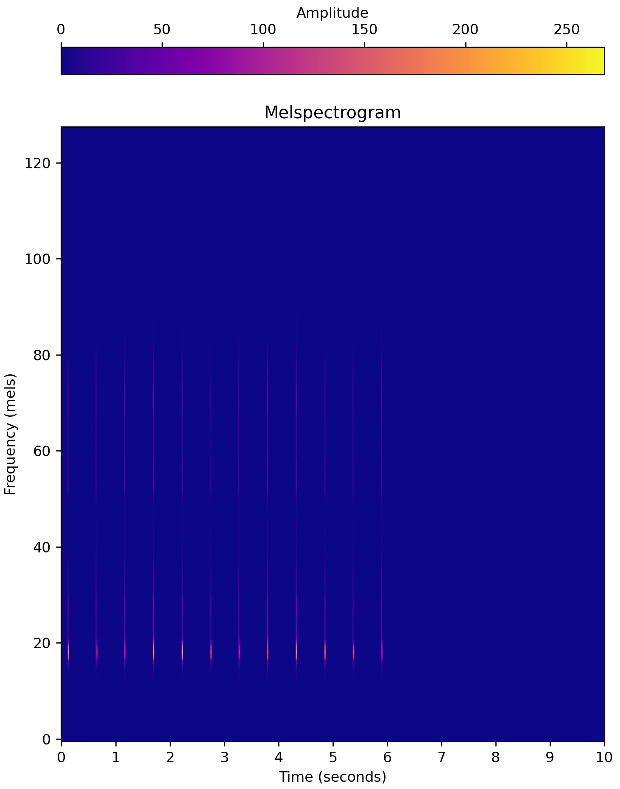
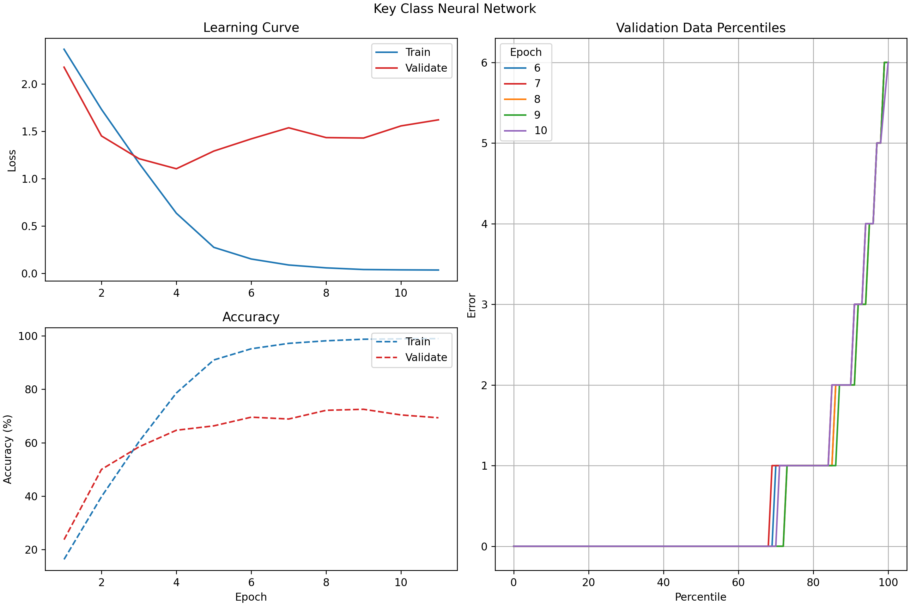
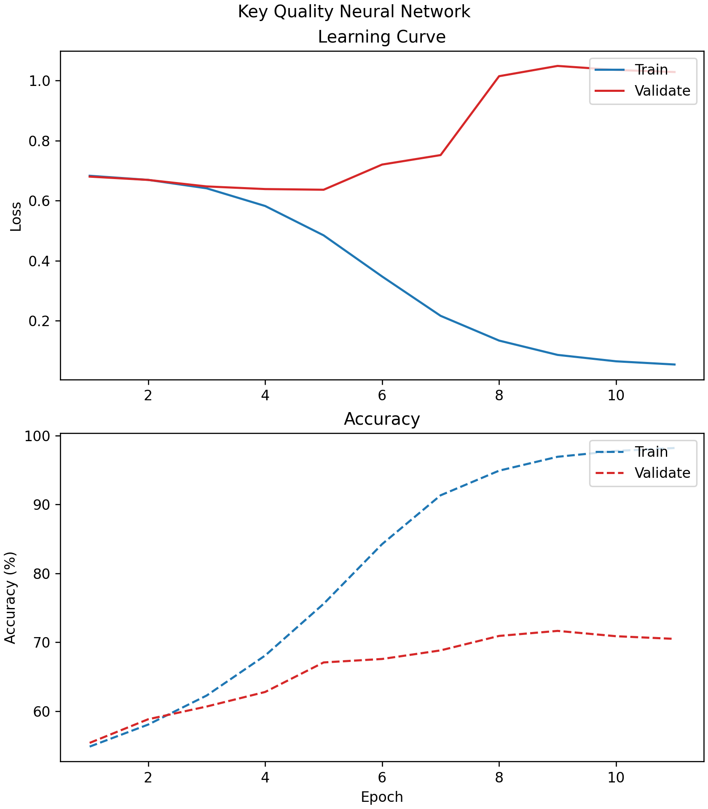
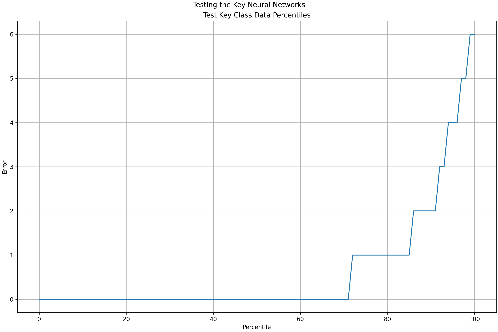

# determine_key
Determine the musical key of a given audio sample.

---

## Background

Though perhaps not as important as tempo, musical key comes in at a close second. If DJs do not mix into songs with certain correct keys, to an untrained ear, their mix will sound cacauphonous. To a trained ear, it just sounds bad. Therefore, it is important that DJs know the keys of both the song they are mixing out-of and the song they are mixing into. I will use machine learning to take an audio file (**.mp3**) as input and output a song's musical key through two values:

1. The song's relative key / key signature (Ex. "A Major / f# minor"); **key class**.
2. Whether the song is in a Major or minor key; **key quality**.


## Data

I can use two approaches for collecting data:

- [Looperman.com](https://www.looperman.com/) offers a massive selection of audio samples and loops, all of which are labelled by key and BPM. Though I believe that these samples would not be beneficial for training a neural network to determine BPM as they are too short, they could be useful for training a neural network to determine key, as most songs repeat the same chord progression over and over and can thus be aptly described in a short audio sample. The main downside of this method is that key information might not extrapolate to longer audio files (i.e. a neural network trained on loops cannot determine the key of an entire song). The upside, however, is that this method has potential for generating a lot of data, since Looperman is a plentiful resource for audio files.
- I have to label the different sections (intro, verse, chorus, outro) of the songs in my collection for the next phase of my AI DJ project anyways. I could push this step forward and use this information as training data for detecting key and BPM. For example, with a track labelled as having an intro, verse, chorus, verse, chorus, and outro, I can divide the song into 6 separate audio files, one per section and still retaining the metadata of the original track. What this equates to is that for each song in my ideally ~1000 track collection, I will now have an average of ~6 files per song, meaning I have much more data for training. The main downside of this method is that the dataset is hard to construct, and thus it had less potential for a lot of data when compared to the Looperman method. The upside, however, is that this dataset is applicable to multiple phases of the project, and for the purposes of key determination, I believe it is more likely to extrapolate to longer audio files.

For either data approach, I would split the data 70%-20%-10% into training, cross-validation, and test datasets, respectively.

I will use Fourier transforms to convert raw-audio-waveform into melspectrogram data, which I will then use to train my neural networks. Raw audio waveforms represent amplitude (not a pitch-based value) as a function of time, and are thus hard to use for determining key; melspectrograms, on the other hand, display what is effectively pitch as a function of time. [Melspectrograms are better than normal spectrograms](https://medium.com/analytics-vidhya/understanding-the-mel-spectrogram-fca2afa2ce53) because the mel scale better represents the human perception of pitch than the frequency scale, and thus, musical notes and chords are more apparent. Below is an example of what a melspectrogram that I feed my neural network could look like (this particular example shows a metronome click).



I ended up employing an approach similar to the one I used in my [determine_tempo project](https://github.com/pnlong/determine_tempo). For each song in my 2000-song personal music library, I split each song into a bunch of 20-second-long "clips" spaced five seconds apart. This meant that for each song, I had around 30 "clips". Ultimately, I trained my neural network(s) on 71,750 samples of audio.


## Strategies for Improving Data

On its own, audio data is hard to collect. Of the two methods mentioned previously, the latter is especially time consuming to label. Despite this, we can use certain strategies to improve data quality by creating larger datasets from our original audio files.

- **Key Extrapolation** is a term I have coined for creating a lot of new audio data from an audio file that has been labelled with a musical key. For a given loop in a certain key, I can transpose the audio file into the 11 other possible keys. I will create new audio files for the 6 keys transposed-up and 5 keys transposed-down from the original, which is better than the alternative of tranposing 11 keys up or down as both options will significantly distort later keys. For instance, if I receive a loop in D Major, I can transpose it up, creating a new file for D# Major all the way up to G# Major, and transpose it down, creating a new file for C# Major all the way down to A Major. This will generate 12 times more data than before. Given 1000 loops, there is the potential for 12000 easily-obtained data points.
- **Audio Shuffling** is another term I have coined for creating a lot of new audio data from an audio file, ideally a loop. Performing this action many times, I could identify each bar of a loop and shuffle them around, creating multiple new loops. Chord progressions would be altered, but because none of the notes changed, in theory, the audio will retain its original key. Though this strategy has the potential to massively increase the amount of data I have, in practice, it could ruin some chord progressions and actually hurt the accuracy of the dataset. I will stay away from it for now.

I ended up not using either of these strategies. Audio shuffling was too difficult to implement, and key extrapolation created pseudo-replicates that I worried would amplify errors in the audio key labels.


## Machine Learning

I will use PyTorch to create two Convolutional Neural Networks (CNNs) that take .MP3 files as input and each output a value, the song's relative key and whether the sample is Major or minor. The hope is that CNNs can better detect patterns in the audio data such as a bassline or chords that are useful in determining a song's key. I faced the same debate as I do for [determining tempo](https://github.com/pnlong/determine_tempo): should I use a CNN with windowing and pick the median key value, or should I use Long Short Term Memory (LSTM)? The advantage of the former is the potential for a lot of data, though the latter seems like it is more suited for this challenge (not to mention I could learn a lot from implementing LSTM or even Attention).

I ended up using the CNN approach, as LSTMs were too difficult to implement at my current level. Additionally, CNNs are pretty easy to train and seem to be the norm for this type of problem.


## Output

As previously mentioned, the neural networks will each have a different output:

1. **Key Class**: As a multilabel classification problem, the final layer of this neural network will output a vector of 12 logits/probabilities; indicies 0 through 11 represent "key classes" [C Major / A minor] through [F Major / D minor] (in Circle of Fifths order), respectively. A key class is essentially relative keys that share a key signature. The index with the highest probability will decide the key class of the audio file. For instance, if index 0 yields the highest probability, then the song is either in C Major or A minor and it is up for the second neural network to decide between the two. The trained key class neural network parameters can be found at [this link](https://drive.google.com/file/d/1b8UxmMRCjyzCr7sUSMNQ2tzx_EENNfep/view?usp=drive_link).
2. **Key Quality**: As a binary classification problem, the final layer of this neural network will output a single value representing the probability that the file is in a Major (as opposed to Minor) key. A value >=`0.5` suggests that the audio file is in a minor key, while a value <`0.5` suggests the song is in a Major key. The trained key quality neural network parameters can be found at [this link](https://drive.google.com/file/d/1ghuohoO8F818Nl2lTEc9Fr134Pg-asMO/view?usp=drive_link).


---

## Software


### *key_dataset.py*

Creates a dataset of *.wav* files that are labelled by key. Will be used to train a neural network.

```
python ./key_dataset.py labels_filepath output_filepath audio_dir
```

- `labels_filepath` is the absolute filepath to the file generated by `data_collection.py` (see the [*artificial_dj* Github Repo](https://github.com/pnlong/artificial_dj)), which contains the absolute filepaths for **.mp3** files labelled by key (and tempo).
- `output_filepath` is the absolute filepath to which a key-specific, labelled dataset will be outputted.
- `audio_dir` is the absolute filepath to the directory where preprocessed **.wav** files will be outputted. These audio samples will be used for machine learning.


### *key_*{class, quality}*_neural_network.py*

Trains a neural network to determine the key (in Beats per Minute) of an inputted audio file.

```
python ./key_class_neural_network.py labels_filepath nn_filepath freeze_pretrained epochs
python ./key_quality_neural_network.py labels_filepath nn_filepath freeze_pretrained epochs
```

- `labels_filepath` is the absolute filepath to the file generated by `key_dataset.py`, which contains the absolute filepaths for **.wav** files labelled by key (in BPM).
- `nn_filepath` is the absolute filepath to which the parameters of the trained neural network will be saved. Use the **.pth** file extension.
- `freeze_pretrained` is a boolean value that represents what layers of the network will be trained. If `True`, the pretrained layers of the network will be frozen while the final regression layer is trained. If `False`, all layers of the pretrained network will be unfrozen and trained. Defaults to `True`.
- `epochs` is the number of epochs that will be used to train the neural network. Defaults to 10 epochs.


### *training_plots_*{class, quality}*.py*

Creates plots describing the training process of the key class and quality neural networks. Assumes `key_neural_network.py` has been previously run.

```
python ./training_plots_class.py history_filepath percentiles_history_filepath output_filepath
python ./training_plots_quality.py history_filepath output_filepath
```

- `history_filepath` is the absolute filepath to the loss and accuracy history **.tsv** file generated by `key_{class, quality}_neural_network.py`.
- `percentiles_history_filepath` is the absolute filepath to the history of error percentiles **.tsv** file generated by `key_class_neural_network.py`.
- `output_filepath` is the absolute filepath where the final plot will be outputted.


### *key_inferences.py*

Tests the accuracy of the key class and quality neural networks.

```
python ./key_inference.py labels_filepath key_class_nn_filepath key_quality_nn
```

- `labels_filepath` is the absolute filepath to the file generated by `key_dataset.py`, which contains the absolute filepaths for **.wav** files labelled by key (in BPM).
- `key_class_nn_filepath` is the absolute filepath to the **.pth** file for the key class neural network trained in `key_class_neural_network.py`.
- `key_quality_nn_filepath` is the absolute filepath to the **.pth** file for the key quality neural network trained in `key_quality_neural_network.py`.

---

### *train_key_*{class, quality}*.sh*

Trains key class and quality neural networks on a cluster. Assumes `key_dataset.py` has already been run.

```
sbatch ./train_key_class.sh -e <epochs> -f <freeze_pretrained>
sbatch ./train_key_quality.sh -e <epochs> -f <freeze_pretrained>
```

- `-e` is the number of epochs to train.
- `-f` is a boolean value representing which layers of the neural network will be frozen in training. See the description of `key_neural_network.py` for more information on this argument.


### *test.sh*

Runs `key_inferences.py` on a cluster.

```
sbatch ./test.sh
```

### *gunzip_key_data.sh*

"Ungzips" and "untars" the directory created by `key_dataset.py` on the cluster.

```
sbatch ./gunzip_key_data.sh
```

---

### *determine_key.py*

Given a song (**.mp3**), output its predicted key.

```
python ./determine_key.py key_class_nn_filepath key_quality_nn_filepath song_filepath
```

- `key_class_nn_filepath` is the absolute filepath to the **.pth** file for the key class neural network trained in `key_class_neural_network.py`.
- `key_quality_nn_filepath` is the absolute filepath to the **.pth** file for the key quality neural network trained in `key_quality_neural_network.py`.
- `song_filepath` is the absolute filepath to the song (**.mp3**) whose key will be predicted.

---


## Results

See the raw training and testing results in `train_key_{class, quality}.out` and `test.out`.

Going into this project, I already had the experience of my [determine_tempo](https://github.com/pnlong/determine_tempo) project. So, it went a lot faster, and I didn't do too much to modify my neural network architures.

Determining key is not an easy feat. When compared to the tempo of a track, key is a lot more abstract; despite there being only 12 unique key signatures, for any given key signature, at the most basic level, there are two key qualities: major and minor. But going further into it, on top of major (Ionian mode) and minor (Aeolian mode), there are five other "modes" as well as different types of minor (harmonic and melodic). The list probably goes on, but I am not advanced enough in my music theory to know any more...

On top of this, there is a musical concept known as the "Circle of Fifths" (see below), which essentially shows that all keys are related, but some keys are more related than others. Adjacent keys on the Circle of Fifths are very closely related, only differing by a single key-signature note; they are a "fifth" apart and the namesake of this musical concept. These adjacent keys can be played together without creating much dissonance, and can in fact sound quite good together. Meanwhile, the farther apart a key is from another on the Circle, the more their key signatures differ; in practice, this means that when played together, these keys sound extremely dissonant and do not share many, if any, notes. The most extreme case of this is when two keys are on opposite sides of the Circle (e.g. C and F# Major), and they do not share any notes. Opposite sides of the Circle are six steps apart. This can become an error metric! A prediction by my neural network has an error of 0 if the key is correctly predicted. If my neural network predicts a key that is only slightly off from the actual key (for example, a prediction of G Major when the actual key is C Major), the error will be 1. However, if the neural network's prediction is totally off, and predicts a key on the opposite side of the Circle, the error will be 6.


Adding more fuel to the flame, the difference between major and minor is vague, and is a problem that even humans struggle with. Young music students often learn that major keys "feel happy" while minor keys "feel sad". Musicians must rely on contextual clues inside of the music, such as the root note (which itself can be hard to determine), to determine key quality (major or minor). Because of all this, I can't have that high expectations when it comes to predicting key quality.

With all that being said, a goal of, say, 95% accuracy for key prediction is unrealistic. Because of all the quirks of music theory, I went into this with little expectations for predicting the *exact* key. I hoped to predict the *exact* key class (key signature) maybe 60% of the time; however, I hoped to predict the key class within 2 steps on the Circle of Fifths 90% of the time. As for key quality, I was aiming for correct key quality prediction with around 75% accuracy; I often struggle with this myself, so I think it would be unfair to ask a neural network to perform any better.

For both key class and quality, I originally attempted to use `torchvision`'s pretrained networks, specifically *ResNet50*. Upon loading *ResNet50*'s default weights, I replaced the final classification block with a regression block. The architecture of my regression block looked like the following. Note that a linear block consists of a linear layer followed by a ReLU activation function.

- linear block 1 (1000-feature output)
- linear block 2 (500-feature output)
- linear block 3 (100-feature output)
- output layer (12-feature output [key class] OR single-feature output followed by a sigmoid function [key quality])

The model performed OK, but it was at this point in my project that I returned to a custom model architecture, since this method had yielded significantly improved performance in my [determine_tempo](https://github.com/pnlong/determine_tempo) project. Both the key-class and -quality neural networks had similar architectures, the only difference being the final layer. Note that a convolutional block consists of a convolutional layer followed by a ReLU activation function and 2D max-pooling. It looked like this:

- convolutional block 1
- convolutional block 2
- convolutional block 3
- convolutional block 4
- flattening layer
- linear block 1 (1000-feature output)
- linear block 2 (500-feature output)
- linear block 3 (100-feature output)
- output layer

I trained both networks on 10 epochs.

For key class, the output was a single linear layer with 12 features, each representing a different class. I did not end this model with a softmax layer, so my outputs are logits in order to improve the performance of the Cross Entropy loss function.



The percentiles plot shows that I achieved my goal: roughly 90% of samples had an error less than 2. Additionally, the neural network is able to predict the *exact* key 65% of the time -- not bad! I was happy with this result.

For key quality, the output was a single-output linear layer followed by a Sigmoid activation function. A probability >=0.5 indicated that the input was predicted to be in a minor key, while a probability <0.5 indicated the input was major.



The accuracy for predicting key quality plateaud at around 70% on the validation data. This was less than ideal, but I also felt that some of this was due in part to mislabelled data, as I collected music labels from the internet (Spotify API to be precise). From my preliminary experiments, Spotify often struggled to *exactly* classify the key of a lot of songs, which expressed itself in Major/minor misclassification (e.g. A minor when the song is actually C Major).

I was happy with my result. I mostly cared about key class and less about key quality, and my network did a good job on the former. Testing on data not used in training yields the following percentiles plot for key class, which shows that the model performs with similar metrics on data it has never seen.



Additionally, here are some statistics from this test:

```
Determining Key Accuracy: 5.18%
Key Class Accuracy: 71.78%
Key Quality Accuracy: 71.28%
```

Unfortunately, predicting the *exact* key remains a difficult task, with my model performing only slightly better than random (1/24). However, when one takes into account relative keys, my model performs a lot better, with a ~70% accuracy rate for predicting both key class and quality. And this doesn't even account for similar key classes (e.g. F and Bb Major).

With this result, I concluded (for now) my project of using machine learning to determine the key of a song.