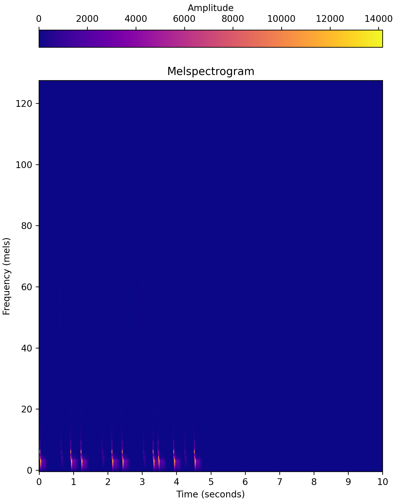

# determine_key
Determine the musical key of a given audio sample.

---

## Background

Though perhaps not as important as tempo, musical key comes in at a close second. If DJs do not mix into songs with certain correct keys, to an untrained ear, their mix will sound cacauphonous. To a trained ear, it just sounds bad. Therefore, it is important that DJs know the keys of both the song they are mixing out of and the song they are mixing into. I will use machine learning to take an audio file (.MP3) as input and output a song's musical key through two values:

1. The song's relative key / key signature (Ex. "A Major / f# minor")
2. Whether the song is in a Major or minor key


## Data

I can use two approaches for collecting data:

- [Looperman.com](https://www.looperman.com/) offers a massive selection of audio samples and loops, all of which are labelled by key and BPM. Though I believe that these samples would not be beneficial for training a neural network to determine BPM as they are too short, they could be useful for training a neural network to determine key, as most songs repeat the same chord progression over and over and can thus be aptly described in a short audio sample. The main downside of this method is that key information might not extrapolate to longer audio files (i.e. a neural network trained on loops cannot determine the key of an entire song). The upside, however, is that this method has potential for generating a lot of data, since Looperman is a plentiful resource for audio data.
- I have to label the different sections (intro, verse, chorus, outro) of the songs in my collection for the next phase of my AI DJ project anyways. I could push this step forward and use this information as training data for detecting key and BPM. For example, with a track labelled as having an intro, verse, chorus, verse, chorus, and outro, I can divide the song into 6 separate audio files, one per section and still retaining the metadata of the original track. What this equates to is that for each song in my ideally ~1000 track collection, I will now have an average of ~6 files per song, meaning I have much more data for training. The main downside of this method is that the dataset is hard to construct, and thus it had less potential for a lot of data when compared to the Looperman method. The upside, however, is that this dataset is applicable to multiple phases of the project, and for the purposes of key determination, I believe it is more likely to extrapolate to longer audio files.

For either data approach, I would split the data 70%-20%-10% into training, cross-validation, and test datasets, respectively.

I will use Fourier transforms to convert raw-audio-waveform into melspectrogram data, which I will then use to train my neural networks. Raw audio waveforms represent amplitude (not a pitch-based value) as a function of time, and are thus hard to use for determining key; melspectrograms, on the other hand, display what is effectively pitch as a function of time. [Melspectrograms are better than normal spectrograms](https://medium.com/analytics-vidhya/understanding-the-mel-spectrogram-fca2afa2ce53) because the mel scale better represents the human perception of pitch than the frequency scale, and thus, musical notes and chords are more apparent.


## Strategies for Improving Data

On its own, audio data is hard to collect. Of the two methods mentioned previously, the latter is especially time consuming to label. Despite this, we can use certain strategies to improve data quality by creating larger datasets from our original audio files.

- **Key Extrapolation** is a term I have coined for creating a lot of new audio data from an audio file that has been labelled with a musical key. For a given loop in a certain key, I can transpose the audio file into the 11 other possible keys. I will create new audio files for the 6 keys transposed-up and 5 keys transposed-down from the original, which is better than the alternative of tranposing 11 keys up or down as both options will significantly distort later keys. For instance, if I receive a loop in D Major, I can transpose it up, creating a new file for D# Major all the way up to G# Major, and transpose it down, creating a new file for C# Major all the way down to A Major. This will generate 12 times more data than before. Given 1000 loops, there is the potential for 12000 easily-obtained data points.
- **Audio Shuffling** is another term I have coined for creating a lot of new audio data from an audio file, ideally a loop. Performing this action many times, I could identify each bar of a loop and shuffle them around, creating multiple new loops. Chord progressions would be altered, but because none of the notes changed, in theory, the audio will retain its original key. Though this strategy has the potential to massively increase the amount of data I have, in practice, it could ruin some chord progressions and actually hurt the accuracy of the dataset. I will stay away from it for now.


## Machine Learning

I will use PyTorch to create two Convolutional Neural Networks (CNNs) that take .MP3 files as input and each output a value, the song's relative key and whether the sample is Major or minor. The hope is that CNNs can better detect patterns in the audio data such as a bassline or chords that are useful in determining a song's key. I face the same debate as I do for [determining tempo](https://github.com/pnlong/determine_tempo): should I use a CNN with windowing and pick the median key value, or should I use Long Short Term Memory (LSTM)? The advantage of the former is the potential for a lot of data, though the latter seems like it is more suited for this challenge (not to mention I could learn a lot from implementing LSTM or even Attention).


## Output

As previously mentioned, the neural networks will each have a different output:

1. **Key Class**: As a multilabel classification problem, the final layer of this neural network will output a vector of 12 logits/probabilities; indicies 0 through 11 represent "key classes" [C Major / A minor] through [F Major / D minor] (in circle of fifths order), respectively. A key class is essentially relative keys that share a key signature. The index with the highest probability will decide the key class of the audio file. For instance, if index 0 yields the highest probability, then the song is either in C Major or A minor and it is up for the second neural network to decide between the two.
2. **Key Quality**: As a binary classification problem, the final layer of this neural network will output a single value representing the probability that the file is in a Major (as opposed to Minor) key. A value >=`0.5` suggests that the audio file is in a minor key, while a value <`0.5` suggests the song is in a Major key.


---

## Software


### *key_dataset.py*

Creates a dataset of *.wav* files that are labelled by key. Will be used to train a neural network.

```
python ./key_dataset.py labels_filepath output_filepath audio_dir
```

- `labels_filepath` is the absolute filepath to the file generated by `data_collection.py` (see the [*artificial_dj* Github Repo](https://github.com/pnlong/artificial_dj)), which contains the absolute filepaths for **.mp3** files labelled by key (and tempo).
- `output_filepath` is the absolute filepath to which a key-specific, labelled dataset will be outputted.
- `audio_dir` is the absolute filepath to the directory where preprocessed **.wav** files will be outputted. These audio samples will be used for machine learning.


### *key_*{class, quality}*_neural_network.py*

Trains a neural network to determine the key (in Beats per Minute) of an inputted audio file.

```
python ./key_class_neural_network.py labels_filepath nn_filepath freeze_pretrained epochs
python ./key_quality_neural_network.py labels_filepath nn_filepath freeze_pretrained epochs
```

- `labels_filepath` is the absolute filepath to the file generated by `key_dataset.py`, which contains the absolute filepaths for **.wav** files labelled by key (in BPM).
- `nn_filepath` is the absolute filepath to which the parameters of the trained neural network will be saved. Use the **.pth** file extension.
- `freeze_pretrained` is a boolean value that represents what layers of the network will be trained. If `True`, the pretrained layers of the network will be frozen while the final regression layer is trained. If `False`, all layers of the pretrained network will be unfrozen and trained. Defaults to `True`.
- `epochs` is the number of epochs that will be used to train the neural network. Defaults to 10 epochs.


### *training_plots_*{class, quality}*.py*

Creates plots describing the training process of the key class and quality neural networks. Assumes `key_neural_network.py` has been previously run.

```
python ./training_plots_class.py history_filepath percentiles_history_filepath output_filepath
python ./training_plots_quality.py history_filepath output_filepath
```

- `history_filepath` is the absolute filepath to the loss and accuracy history **.tsv** file generated by `key_{class, quality}_neural_network.py`.
- `percentiles_history_filepath` is the absolute filepath to the history of error percentiles **.tsv** file generated by `key_class_neural_network.py`.
- `output_filepath` is the absolute filepath where the final plot will be outputted.


### *key_inferences.py*

Tests the accuracy of the key class and quality neural networks.

```
python ./key_inference.py labels_filepath key_class_nn_filepath key_quality_nn
```

- `labels_filepath` is the absolute filepath to the file generated by `key_dataset.py`, which contains the absolute filepaths for **.wav** files labelled by key (in BPM).
- `key_class_nn_filepath` is the absolute filepath to the **.pth** file for the key class neural network trained in `key_class_neural_network.py`.
- `key_quality_nn_filepath` is the absolute filepath to the **.pth** file for the key quality neural network trained in `key_quality_neural_network.py`.

---

### *train_key_*{class, quality}*.sh*

Trains key class and quality neural networks on a cluster. Assumes `key_dataset.py` has already been run.

```
sbatch ./train_key_class.sh -e <epochs> -f <freeze_pretrained>
sbatch ./train_key_quality.sh -e <epochs> -f <freeze_pretrained>
```

- `-e` is the number of epochs to train.
- `-f` is a boolean value representing which layers of the neural network will be frozen in training. See the description of `key_neural_network.py` for more information on this argument.


### *test.sh*

Runs `key_inferences.py` on a cluster.

```
sbatch ./test.sh
```

### *gunzip_key_data.sh*

"Ungzips" and "untars" the directory created by `key_dataset.py` on the cluster.

```
sbatch ./gunzip_key_data.sh
```

---

### *determine_key.py*

Given a song (**.mp3**), output its predicted key.

```
python ./determine_key.py key_class_nn_filepath key_quality_nn_filepath song_filepath
```

- `key_class_nn_filepath` is the absolute filepath to the **.pth** file for the key class neural network trained in `key_class_neural_network.py`.
- `key_quality_nn_filepath` is the absolute filepath to the **.pth** file for the key quality neural network trained in `key_quality_neural_network.py`.
- `song_filepath` is the absolute filepath to the song (**.mp3**) whose key will be predicted.

---


## Results

See the raw training and testing results in `train_key_{class, quality}.out` and `test.out`.


I first attempted to create my own neural network from scratch. Note that one of my "convolutional blocks" consists of a convolutional layer followed by a ReLU activation function and max-pooling. My network had the following layout:

- convolutional block 1
- convolutional block 2
- convolutional block 3
- convolutional block 4
- flattening layer
- linear layer 1 (100 output features)
- linear layer 2 (10 output features)
- output layer (single-feature output, predicted BPM)

This network performed poorly. On both training and validation sets, predicted tempos had an average error of roughly 18 BPM; this was inadequate for my standards. Because the training and validation sets had similar errors, I could tell that my network was suffering from neither high variance nor bias. Combined with the fact that its learning curve had essentially flattened-out after two out of 10 epochs of training, I diagnosed my original network's problem as poor network architecture.

To clarify, my ultimate goal is to train a network that predicts tempo with an average error of less than 5 BPM, and with 95% of predictions having an error of less than 10 BPM.

My next attempt involved using `torchvision`'s pretrained networks, specifically *ResNet50*. Upon loading *ResNet50*'s default weights, I replaced the final classification block with a single-feature-output regression block. The architecture of my regression block looked like this:

- linear layer 1 (1000 output features)
- linear layer 2 (single-feature output)

My method of training involved freezing all of the pretrained *ResNet50* weights while I trained my regression block, followed up by a fine-tuning of the pretrained weights for the same amount of epochs while I froze my regression block. I repeated this back-and-forth process three times, training six epochs each on the first pass, four each on the second pass, and finally two each on the third pass. To my surprise, this model actually performed slightly worse than my custom one, with an average error on both the training and validation sets of about 20 BPM. It was then that I realized that I had forgot a crucial detail in my final regression block: activation functions! Note that a linear block consists of a linear layer followed by a ReLU activation function. I reworked the architecture of my regression block so that it looked like this:

- linear block 1 (1000-feature output)
- linear block 2 (500-feature output)
- linear block 3 (100-feature output)
- output layer (single-feature output, the tempo in BPM)

Ultimately, however, this didn't change much. I had begun tracking various statistics at this point, and they showed that my model was performing quite poorly (see below).


Per my dad's recommendation, I began to target the quality of my input data rather than my network architecture. I did this by applying an autocorrelation function (ACF) to each Mel in my input melspectrograms, thinking this would better capture the periodic nature of music (the tempo). The plot below probably explains it better, but it shows the melspectrogram of a metronome playing at 120 BPM, and then the ACF on the right; the ACF shows a period of ~0.52 seconds, which when converted back into BPM turns out to 115.4 BPM. My hope was that this image would make it easier for my convolutional neural network to pick up on the tempo.


However, metronomes are as simple as they come, so below is a more complex example of a kick drum pattern at 100 BPM.



At the same time, after a meeting with my lab advisor, he pointed out that deep learning models tend to perform better on classification tasks as opposed to regression ones. Instead of outputting a single value, he suggested I should have my model classify any given song to a "tempo range". I implemented this by changing my output to 86 probabilities that map to "tempo ranges"; each "tempo range" represents an integer tempo in the range (85 BPM, 170 BPM]. For example, if applying an argmax function to my model's 86-feature output yielded an index of 0, then the input song has a predicted tempo in the range [85, 86) BPM; if this process outputted an index of 85, the song has a predicted tempo of [170, 171) BPM. In an ideal world, if my model was able to predict tempos with 100% accuracy, even though there is a loss in quality due to my use of *tempo ranges* as opposed to *exact tempos*, the model would only have a maximum error of 0.5 BPM; in the grand scheme of things, a difference in tempo of 0.5 BPM would go largely unnoticed by the average music listener. My new network architecture remained quite similar to my original modification of *ResNet50*, with the only change being the output layer. Note that I do not end my model with a softmax layer (my outputs are logits, which improves the performance of the Cross Entropy loss function). On another note, my lab advisor also discouraged my back-and-forth process of fine-tuning the pretrained model, and rather, I should either just train the regression block or fine-tune the entire model altogether. I chose to do the former, as the latter sounded computationally expensive. The new architecture of the regression block was this:

- linear block 1 (1000-feature output)
- linear block 2 (500-feature output)
- linear block 3 (100-feature output)
- output layer (86-feature output, each representing a "tempo range")

Unfortunately, these changes did not improve my model all that much. The median error in tempo prediction had shrunk from 20 BPM to 15 BPM, which was a positive improvement, albeit far from my goal.


At this point, I realized that my code had a somewhat major bug: when I would resume training from the most recent epoch, the loss function would reset. I later learned that this was due to an error in loading that optimizer's `state_dict`, but more importantly, somewhere along in my debugging process, I returned to using my custom network architecture instead of *ResNet50*. To my surprise, it performed a lot better! I think this was due to the fact that I was training the whole model as opposed to just the final regression layer (as was the case with *ResNet50*), and I imagine if I trained all of *ResNet50* on my data, I would achieve similar results. However, my new (or one could say old) model architure now looked like this:

- convolutional block 1
- convolutional block 2
- convolutional block 3
- convolutional block 4
- flattening layer
- linear block 1 (1000-feature output)
- linear block 2 (500-feature output)
- linear block 3 (100-feature output)
- output layer (86-feature output, each representing a tempo "range")

I trained this network on 10 epochs. The median error in tempo predictions was now 0 BPM, and 95% of tempo predictions had an error <10 BPM.


I was very happy with this result. I also suspect that a portion of the 5% of tempo predictions with errors >10 BPM stem from mislabelled data. Testing on data not used in training yields the following percentiles plot, which shows that the model performs with similar metrics on data it has never seen.


With this result, I concluded my project of using machine learning to determine the tempo of a song.